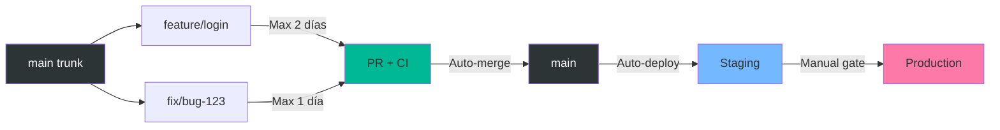

# Trunk-Based Development - Implementación de Ejemplo

Estrategia de desarrollo con un trunk único (main) siempre deployable, donde las ramas de features viven máximo 2 días y se integran automáticamente mediante CI/CD robusto y minimal approval overhead.

## ✅ Estado del Submódulo

- ✅ Trunk-based workflow configurado
- ✅ Auto-merge sin approvals (confianza en CI)
- ✅ Branch lifetime monitor (alerta > 2 días)
- ✅ Deploy automático a Staging
- ✅ CI ultra-rápido (< 3 min)

## 📁 Estructura del Proyecto

```
.
├── .github/
│   └── workflows/
│       ├── trunk-ci.yml               # CI/CD principal
│       └── branch-lifetime-monitor.yml # Monitor de ramas viejas
├── scripts/
│   ├── create-quick-branch.sh         # Crear rama con recordatorio
│   └── check-trunk-health.sh          # Verificar salud del trunk
├── src/
│   └── app/                           # Aplicación Next.js (a crear)
└── README.md
```

## 🎯 Casos de Uso

- Equipos que practican Continuous Integration/Deployment
- Startups y equipos ágiles con ciclos rápidos de desarrollo
- Microservicios con deploys frecuentes
- Proyectos que requieren alta velocidad de desarrollo
- Equipos con excelente cobertura de tests

## 🔄 Flujo de Trabajo



## 🚀 Guía de Implementación Paso a Paso

### 1. Configurar Branch Protection (10 minutos)

**Settings > Branches > Add branch protection rule**:

Para `main`:
```
Branch name pattern: main

☑ Require a pull request before merging
  ☐ Require approvals: 0 (confianza en CI, no approvals)
  ☐ Dismiss stale approvals: OFF
  ☐ Require review from Code Owners: OFF

☑ Require status checks to pass before merging
  ☑ Require branches to be up to date before merging
  
  Status checks required (agregar después del primer CI run):
  - 🔍 Lint
  - 🧪 Test
  - 🔒 Security

☑ Require conversation resolution before merging
☑ Require linear history (recomendado para trunk-based)
☑ Allow auto-merge
☑ Automatically delete head branches

☐ Allow force pushes: Nobody
☐ Allow deletions: Nobody
☐ Require signed commits: (opcional)
```

**🔑 Clave de Trunk-Based**: 
- **NO** requieres approvals humanas
- **SÍ** requieres CI estricto
- Velocidad > Burocracia

### 2. Configurar Permisos de GitHub Actions (2 minutos)

**Settings > Actions > General > Workflow permissions**:
- ☑ **Read and write permissions**
- ☑ **Allow GitHub Actions to create and approve pull requests**

### 3. Configurar Environment para Staging (5 minutos)

**Settings > Environments > New environment**:

Name: `staging`

```
☐ Required reviewers: ninguno (auto-deploy)
☐ Wait timer: 0 minutes
Deployment branches: Only main
```

**Environment variables**:
- `STAGING_URL`: `https://staging.tuapp.com`

### 4. Crear Aplicación Next.js (Opcional)

```bash
cd src
npx create-next-app@latest app --typescript --tailwind --app --no-src-dir
```

O copiar de otro submódulo:

```bash
cp -r ../AutoMergeFeature/src/app src/
```

### 5. Primera Prueba - Quick Feature (15 minutos)

#### Paso 1: Crear rama de feature rápida

```bash
# Opción A: Usar el script
./scripts/create-quick-branch.sh
# > Feature: login-page
# > Tipo: 1 (feature)

# Opción B: Manual
git checkout main
git pull origin main
git checkout -b feature/login-page
```

#### Paso 2: Hacer cambios pequeños

```bash
cd src/app/app

# Crear componente simple
cat > login-page.tsx << 'EOF'
export default function LoginPage() {
  return (
    <div className="p-4">
      <h1 className="text-2xl font-bold">Login</h1>
      <p>Trunk-based development example</p>
    </div>
  );
}
EOF

cd ../../..
```

#### Paso 3: Commit y push

```bash
git add .
git commit -m "feat: Add login page component"
git push -u origin feature/login-page
```

#### Paso 4: Crear PR

```bash
# Con gh CLI
gh pr create \
  --title "feat: Add login page component" \
  --body "Quick feature for trunk-based development testing.

## Changes
- Added login page component
- Ready to merge in < 2 days

## Testing
- Build: Will be tested by CI
- Lint: Will be tested by CI" \
  --base main
```

O crear desde GitHub UI.

#### Paso 5: Observar Auto-Merge

1. Ve a **Actions** en GitHub
2. El workflow `🚀 Trunk-Based CI/CD` se ejecuta:
   - 🔍 Lint (< 30s)
   - 🧪 Test (< 2min)
   - 🔒 Security (< 1min)
   - 🤖 Auto-Merge (automático)

3. **Sin aprobación humana**, el PR se fusiona automáticamente

4. **Deploy automático** a Staging

### 6. Monitorear Branch Lifetime

El workflow `branch-lifetime-monitor.yml` ejecuta diariamente:

```bash
# Ver manualmente
./scripts/check-trunk-health.sh

# Ver ramas viejas
git branch -r --sort=-committerdate | head -10
```

Si una rama tiene > 2 días:
- El workflow comenta en el PR
- Te notifica por email
- Sugiere acciones

## 📊 Filosofía Trunk-Based

### ✅ Sí Hacer

1. **Ramas de corta duración**: Max 2 días
2. **Commits pequeños**: 1 feature = 1 PR
3. **CI robusto**: Confía en los tests, no en approvals
4. **Deploy frecuente**: Main → Staging automático
5. **Main siempre verde**: Nunca dejar main roto

### ❌ No Hacer

1. **Ramas de larga duración**: > 2 días
2. **PRs grandes**: > 400 líneas
3. **Esperar approvals**: Confía en CI
4. **Feature branches complejas**: Divide en sub-features
5. **Merge conflicts**: Integra frecuentemente

## 🔍 Comandos Útiles

```bash
# Crear rama rápida con recordatorio
./scripts/create-quick-branch.sh

# Verificar salud del trunk
./scripts/check-trunk-health.sh

# Ver ramas activas
git branch -r | grep -v main

# Ver ramas más antiguas
git for-each-ref --sort=-committerdate refs/remotes/origin --format='%(committerdate:short) %(refname:short)'

# Ver PRs abiertos
gh pr list

# Ver último deploy a staging
gh run list --workflow="Trunk-Based CI/CD" --branch main --limit 1

# Merge rápido manual (si necesario)
gh pr merge <PR_NUMBER> --squash --delete-branch
```

## 🎯 Métricas de Éxito

### Velocidad

- **Tiempo de PR a merge**: < 4 horas
- **Frecuencia de commits a main**: 5-10 por día
- **Frecuencia de deploy**: 3-5 por día

### Calidad

- **Main siempre verde**: 99%+
- **Rollback rate**: < 1%
- **Test coverage**: > 80%

### Monitoreo

```bash
# Ver métricas del último mes
git log --since="1 month ago" --oneline | wc -l   # commits
gh pr list --state closed --limit 100 | wc -l     # PRs mergeados
```

## 🔒 Seguridad en Trunk-Based

Aunque no requieres approvals, mantienes seguridad con:

1. **CI estricto**: Lint + Tests + Security
2. **Branch protection**: No push directo a main
3. **Automated testing**: Coverage > 80%
4. **Staging environment**: Validación pre-producción
5. **Rollback rápido**: Revert inmediato si algo falla

## 🛠️ Troubleshooting

### CI tarda mucho (> 5 min)

**Optimizar**:

```bash
# Paralelizar tests
npm test -- --maxWorkers=50%

# Cache de dependencias
# Ya configurado en workflow con cache: 'npm'

# Reducir scope de lint
npm run lint -- --max-warnings=0 --cache
```

### Main se rompe después de merge

**Rollback inmediato**:

```bash
# Ver último commit problemático
git log --oneline -5

# Revertir
git revert <COMMIT_HASH>
git push origin main

# Notificar al equipo
gh issue create --title "Main broken by commit <HASH>" --body "..."
```

### Ramas viejas acumulándose

**Limpiar**:

```bash
# Ver ramas viejas
git branch -r --merged main | grep -v main

# Eliminar ramas mergeadas (cuidado!)
git branch -r --merged main | grep -v main | sed 's/origin\///' | xargs -n 1 git push --delete origin
```

### Desarrollador acostumbrado a approvals

**Educación**:

1. Explicar la filosofía trunk-based
2. Mostrar que CI es suficiente
3. Enfatizar velocidad vs burocracia
4. Pair programming como alternativa a code review

## 📊 Comparación con Gitflow

| Aspecto | Trunk-Based | Gitflow |
|---------|-------------|---------|
| Ramas de feature | Max 2 días | Semanas/meses |
| Approvals | 0 (CI only) | 1-2+ reviewers |
| Deploy frequency | 5-10/día | 1-2/semana |
| Main stability | Always green | Feature branches |
| Merge conflicts | Raros | Frecuentes |
| Time to production | Horas | Días/semanas |
| Overhead | Bajo | Alto |

## 🎉 Resultado Esperado

Después de implementar trunk-based:

1. ✅ Deploys 5-10x más frecuentes
2. ✅ Menos merge conflicts
3. ✅ Feedback más rápido
4. ✅ Main siempre deployable
5. ✅ Menos overhead de reviews

## 🔗 Recursos

- [Documentación completa](../../docs/TrunkBasedShortLivedBranches.md)
- [Trunk Based Development](https://trunkbaseddevelopment.com/)
- [Google's Trunk-Based Development](https://cloud.google.com/architecture/devops/devops-tech-trunk-based-development)
- [Continuous Integration](https://martinfowler.com/articles/continuousIntegration.html)

## 🎯 Próximos Pasos Sugeridos

- Implementar feature flags para release gradual
- Configurar canary deployments
- Agregar smoke tests post-deployment
- Configurar alerting y monitoring
- Implementar automatic rollback

## 📄 Licencia

MIT - Ver [LICENSE](LICENSE)

---

**Nota**: Trunk-based development requiere disciplina y CI robusto. No es adecuado para equipos junior sin tests o con baja cobertura.
